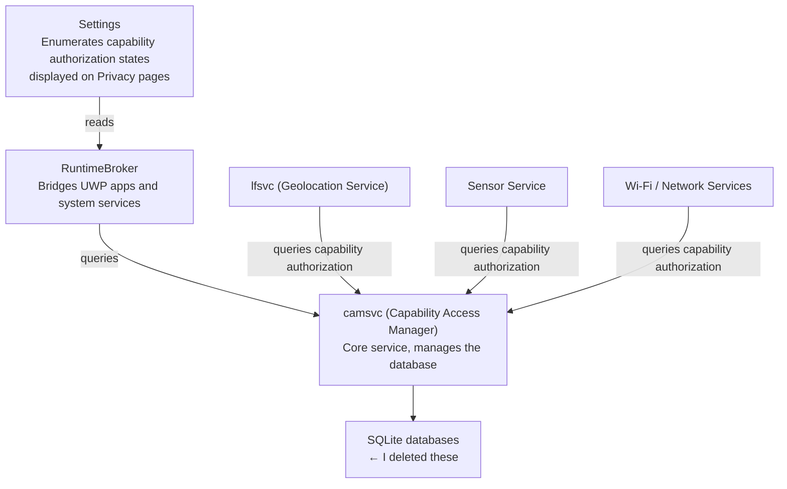

# Deleted That 'Orphaned' Database and Everything Broke — A camsvc Rescue Story

---

> **System**: Windows 11 25H2
> **Incident**: Before 2026/07/14
> **Resolution**: 2026/07/15 (after reboot)

---

## 1. How It Happened

So here's the deal. The `camsvc` (Capability Access Manager Service) `SQLite` database on my machine had let its `WAL` log file balloon to **over 20 GB** — for reasons best known to itself — and my disk was screaming. Figured I'd just torch a few database files to claw some space back. Did the obvious thing:

```powershell 7.6.3
takeown /f "C:\ProgramData\Microsoft\Windows\CapabilityAccessManager" /r /d y
icacls "C:\ProgramData\Microsoft\Windows\CapabilityAccessManager" /grant administrators:F /t
```

Then I nuked every file in that directory. Windows won't even let you delete without taking ownership first, so once you've jumped through that hoop... might as well go all the way, right?

Reality had other plans.

### Timeline of events

| Time           | What happened                                                                  |
| -------------- | ------------------------------------------------------------------------------ |
| Before         | `camsvc`'s `SQLite` `WAL` logs hit 40+ GB total; I deleted the whole directory |
| 07/14 21:18    | Wi-Fi won't connect, camera won't open, GPS completely dead                    |
| 21:19–23:52    | Tried everything myself: `sfc`, `DISM`, resetting `UWP` packages... all futile |
| 23:52          | Sudden realization: this was because I deleted those databases                 |
| 23:52–01:40    | Consulted ChatGPT and Gemini in parallel — the long night of repairs began     |
| (After reboot) | Everything back to normal                                                      |

---

## 2. Root Cause Analysis: One Deleted File, a Cascade of Failures

### 2.1 How Did a 30+ GB File Get Written?

`camsvc` uses `SQLite` to store two kinds of data:

- `CapabilityAccessManager.db` — which apps have requested which system capabilities (camera, microphone, location, Wi-Fi...)
- `CapabilityConsentStorage.db` — whether the user granted or denied each capability

`SQLite` enables WAL (Write-Ahead Log) mode by default. Normally the log gets checkpointed (merged back into the main database) once it reaches a certain size. But if checkpointing gets stuck for some reason, that `-wal` file grows unchecked. That's what happened to me — a single log file eating 30+ GB.

> A friend told me afterwards that his same directory only took up 795 MB. So not everyone gets the bloat, but if you do, start by checking the WAL file size.

### 2.2 The Chain Reaction After Deleting the Databases

The deleted files looked like this:

```
CapabilityAccessManager.db          ← deleted
CapabilityAccessManager.db-wal      ← deleted
CapabilityAccessManager.db-shm      ← deleted
CapabilityConsentStorage.db         ← deleted
CapabilityConsentStorage.db-wal     ← deleted
CapabilityConsentStorage.db-shm     ← deleted
```

I thought these were just cache files the system would recreate automatically. I underestimated how much Windows' architecture has evolved — this database touches far more services than I imagined.



With the databases gone, the entire chain snapped cleanly:

1. **camsvc itself couldn't start** — database files missing, the service crashes during initialization
2. **lfsvc (geolocation), sensor service, Wi-Fi components couldn't get capability grants** — when they ask `camsvc`, it returns empty/error, so they just give up
3. **Settings app crashes on open** — `systemsettings.exe` needs to enumerate all capability authorization states for the Privacy page; `camsvc` returns an exception, Settings crashes without even showing an error
4. **Wi-Fi, camera, location sensors naturally stopped working**

Rookie move, obviously. Felt smart for about five minutes.

### 2.3 Why Did It Only Get Better After Reboot?

Yes yes, 'have you tried turning it off and on again'. But the reboot wasn't some magic bullet — I'd done all the real repair work beforehand. The reboot just gave everything room to fall into place in the right order.

Key repairs I did before rebooting:

| Action                                                  | Why it matters                                                                                            |
| ------------------------------------------------------- | --------------------------------------------------------------------------------------------------------- |
| `takeown` + `icacls` to fix permissions                 | ★★★ Without write permission on the directory, `camsvc` can't create new databases — nothing else matters |
| `regsvr32` to re-register `CapabilityAccessManager.dll` | ★★★ `COM` registration may have been corrupted or lost                                                    |
| Set `camsvc` to auto-start                              | ★★☆ Ensures correct startup order                                                                         |
| Delete leftover `.db-wal`, rename old DB to `.bak`      | ★★☆ Prevents `SQLite` from reading corrupted old data                                                     |
| Reset `UWP` packages                                    | ★☆☆ Auxiliary fix for `Settings` registration state                                                       |

After reboot, these fixes actually took effect:

1. **Correct startup order** — camsvc starts first, dependent services follow without conflict
2. **Database auto-recreation** — camsvc detects missing databases on startup, creates new ones with default authorization states
3. **COM components reloaded** — registry configurations are re-read
4. **Driver re-initialization** — Wi-Fi adapter, camera, and sensor drivers go through their init sequence again
5. **Settings starts clean** — this time it can read capability authorization data without crashing

---

## 3. Recovery Procedure

Here's what worked. Phase A is the minimal path if you haven't dug yourself into the same hole yet.

### Phase A: If You Haven't Deleted the Database Yet — Fix Disk Bloat

You might want to follow what I did the second time around.

> Note from the author while writing:
> ```powershell 7.6.3
> PS C:\ProgramData\Microsoft\Windows\CapabilityAccessManager> dir
>
>     Directory: C:\ProgramData\Microsoft\Windows\CapabilityAccessManager
>
> Mode                 LastWriteTime         Length Name
> ----                 -------------         ------ ----
> -a---            26/07/15    01:35        1048576 CapabilityAccessManager.db
> -a---            26/07/22    22:02        4423680 CapabilityAccessManager.db-shm
> -a---            26/07/22    22:13     2264413832 CapabilityAccessManager.db-wal
> -a---            26/07/20    02:56        1048576 CapabilityConsentStorage.db
> -a---            26/07/17    13:16          32768 CapabilityConsentStorage.db-shm
> -a---            26/07/20    02:56         156592 CapabilityConsentStorage.db-wal
> ```

```powershell 7.6.3
net stop camsvc

cd "C:\ProgramData\Microsoft\Windows\CapabilityAccessManager"
dir

Remove-Item -Force "CapabilityAccessManager.db-wal"
Remove-Item -Force "CapabilityAccessManager.db-shm"
Remove-Item -Force "CapabilityConsentStorage.db-wal"
Remove-Item -Force "CapabilityConsentStorage.db-shm"

net start camsvc
```

If deleting just WAL files isn't enough, consider touching the main database — but make sure you've done the permission prep below first.

---

### Phase B: If You've Already Deleted the Database (Like I Did)

Try not to feel too smart — you're in good company.

#### B1 — Fix Permissions (MUST be first)

```powershell 7.6.3
takeown /f "C:\ProgramData\Microsoft\Windows\CapabilityAccessManager" /r /d y

icacls "C:\ProgramData\Microsoft\Windows\CapabilityAccessManager" /grant administrators:F /t

# Grasping at straws
icacls "C:\ProgramData\Microsoft\Windows\CapabilityAccessManager" /reset /T /C
```

> This is **the single most critical step** in the entire repair. If camsvc doesn't have permission to write new databases in this directory, every command after this is useless. (AI review)

#### B2 — Clean Up Leftovers

```powershell 7.6.3
cd "C:\ProgramData\Microsoft\Windows\CapabilityAccessManager"

# If main DB still exists, back it up
if (Test-Path CapabilityAccessManager.db) { Rename-Item CapabilityAccessManager.db CapabilityAccessManager.db.bak }
if (Test-Path CapabilityConsentStorage.db) { Rename-Item CapabilityConsentStorage.db CapabilityConsentStorage.db.bak }

# Nuke leftover WAL and shared-memory files
Remove-Item -Force "CapabilityAccessManager.db-wal"
Remove-Item -Force "CapabilityConsentStorage.db-wal"
Remove-Item -Force "CapabilityAccessManager.db-shm"
Remove-Item -Force "CapabilityConsentStorage.db-shm"
```

#### B3 — Fix the camsvc Service Itself

```powershell 7.6.3
sc config camsvc start= auto

# Verify ImagePath is correct (default value)
reg add "HKLM\SYSTEM\CurrentControlSet\Services\camsvc" `
    /v ImagePath /t REG_EXPAND_SZ `
    /d "C:\Windows\system32\svchost.exe -k osprivacy -p" /f

regsvr32 /u "C:\Windows\System32\CapabilityAccessManager.dll"
regsvr32 "C:\Windows\System32\CapabilityAccessManager.dll"
```

#### B4 — System File Check + UWP Reset

```powershell 7.6.3
sfc /scannow

DISM /Online /Cleanup-Image /RestoreHealth

Get-AppxPackage *windows.immersivecontrolpanel* | Reset-AppxPackage

Get-AppxPackage -AllUsers | Foreach {
    Add-AppxPackage -DisableDevelopmentMode -Register `
        "$($_.InstallLocation)\AppXManifest.xml"
}
```

#### B5 — Verify Service State

```powershell 7.6.3
net start camsvc
sc query camsvc

# Check related services
sc query lfsv
sc query SensorService
sc query SensorDataService
sc query WlanSvc
```

#### B6 — Reboot

```powershell 7.6.3
Restart-Computer
```

Post-reboot checklist:

- [ ] Can Wi-Fi find and connect to networks?
- [ ] Does the camera work (Camera app, video calls)?
- [ ] Can location services get a fix?
- [ ] Settings → Privacy & security → App permissions → each entry opens without crashing?

---

## 4. Every Command I Ran in Four Hours

For those who love details. I've organized every troubleshooting avenue I tried, marking what was useful (at least for me) and what was wasted effort.

| Approach                        | Command                                                 | Result                                        |
| ------------------------------- | ------------------------------------------------------- | --------------------------------------------- |
| System file checker             | `sfc /scannow`                                          | ❎ Files weren't corrupted                     |
| Image health restore            | `dism /online /cleanup-image /restorehealth`            | ❎ Image was fine                              |
| UWP package reset               | `Reset-AppxPackage *windows.immersivecontrolpanel*`     | ❎ Settings wasn't the root cause              |
| Batch re-register UWP           | `Add-AppxPackage -DisableDevelopmentMode -Register ...` | ❎ No DB to register against anyway            |
| COM DLL re-register             | `regsvr32 CapabilityAccessManager.dll`                  | ⚠️ Necessary but insufficient                  |
| Fix service config              | `sc config camsvc start= auto`                          | ⚠️ Necessary, ensures auto-start               |
| Fix permissions                 | `takeown` + `icacls`                                    | ✅ **The single most critical step**           |
| Manual camsvc start             | `sc start camsvc`                                       | ⚠️ Starts but symptoms persist → needs reboot  |
| Inspect lfsvc loaded modules    | `Get-Process -Id <PID> -Module`                         | 🔍 Confirmed lfsvc depends on camsvc data      |
| Check COM activation logs       | `wevtutil qe Microsoft-Windows-COM/CreateInstance`      | 🔍 Confirmed COM activation failure            |
| Install WinDbg for kernel debug | `winget install Microsoft.WinDbg`                       | 🔍 Did use it, unclear if it materially helped |
| **Final reboot**                | `Restart-Computer`                                      | ✅ All fixes finally took effect               |

---

## 5. Lessons Learned

1. **When SQLite WAL bloats, try deleting just the WAL files first — don't go for the main database right away.** The main DB might be fine, and WAL can be handled independently.

2. **Don't touch unfamiliar system paths.** At least double-check before acting.

3. **Reboot is still an important part of the fix.** Do all the necessary repairs first, then reboot to let them take effect in the correct startup order. Rebooting *then* fixing is like shuffling a deck before sorting it — wasted effort.

4. **Multi-model cross-validation is genuinely useful.** Different models — or better yet, different *model families* — often suggest completely different angles of attack. Having ChatGPT and Gemini tag-team the problem was like getting a real specialist panel together. Would recommend.

5. **Windows' internal coupling is nightmare fuel.** `camsvc` → `lfsvc` → `RuntimeBroker` → `Settings` → `drivers` — all deeply tangled. In 2026, deleting one database can take out your Wi-Fi. Your. Wi-Fi.

## 6. What You Should Do Now

According to reports, Microsoft released a fix `KB5095093` on 2026/06/23:

> 'Optimizing CapabilityAccessManager.db-wal disk usage logic to stop unlimited file growth.'

It specifically addresses the `camsvc` WAL infinite-growth bug. Another patch, `KB5101650`, is also rumoured to help. Check if you have either:

```powershell 7.6.3
Get-HotFix | Where-Object HotFixID -match "KB5101650|KB5095093"
```

If nothing comes back, try:

```powershell 7.6.3
Start-Process ms-settings:windowsupdate
```

and install from Optional Updates (although neither showed up in my available updates).
