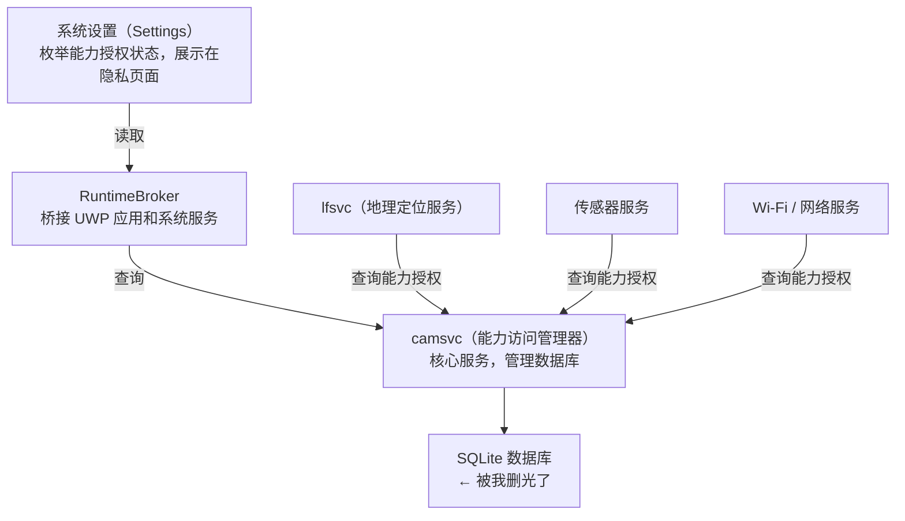

# 删除有主数据库后竟然？——Capability Access Manager Service 翻车抢救

---

> **系统**: Windows 11 25H2
> **事发时间**: 早于 2026/07/14
> **解决时间**: 2026/07/15（重启后）

---

## 一、事情是怎么发生的

先介绍背景。我的电脑上 `camsvc`（Capability Access Manager Service，能力访问管理器）的 `SQLite` 数据库不知什么原因，`WAL` 日志文件一路涨到了 **20 多 GB**，把磁盘吃干了。我想着删掉几个数据库文件清清空间，就干了最直接的一件事——

```powershell 7.6.3
takeown /f "C:\ProgramData\Microsoft\Windows\CapabilityAccessManager" /r /d y
icacls "C:\ProgramData\Microsoft\Windows\CapabilityAccessManager" /grant administrators:F /t
```

然后把这个目录下所有文件删了个精光。毕竟 `Windows` 不拿所有权根本不让删，拿到手之后自然就……删干净了。

然后，报应来得很快。

### 事发时间线

| 时间        | 发生了什么                                                       |
| ----------- | ---------------------------------------------------------------- |
| 事发前      | `camsvc` 的 `SQLite` `WAL` 日志总计暴涨到 40+ GB，被我整目录删除 |
| 07/14 21:18 | Wi-Fi 连不上，摄像头打不开，定位彻底没反应                       |
| 21:19–23:52 | 自己折腾了一通：`sfc`、`DISM`、重置 `UWP` 包……全都石沉大海       |
| 23:52       | 突然意识到：就是之前删库删出的事                                 |
| 23:52–01:40 | 找 ChatGPT 和 Gemini 双模型会诊，开始了漫长的修复                |
| （重启后）  | 一切恢复正常                                                     |

---

## 二、根因分析：删掉一个文件，倒下一片服务

### 2.1 那个 30 多 GB 的文件怎么写出来的

`camsvc` 用 `SQLite` 存了两类信息（我记得好像有证据？）：

- `CapabilityAccessManager.db` —— 哪些应用申请了哪些系统能力（摄像头、麦克风、位置、Wi-Fi……）
- `CapabilityConsentStorage.db` —— 每个能力用户同意还是拒绝了

`SQLite` 默认开 WAL（Write-Ahead Log）模式。正常情况下日志写到一定量就会 checkpoint（合并回主库）。但如果 checkpoint 因为什么原因卡住了，那个 `-wal` 文件就会一路疯涨。我碰上的是就是这种情况，一个日志文件吃了 30 多 GB。

> 补一句：事后跟朋友聊，他那边同样的路径只占了 795 MB。所以不是每个人都暴涨，但如果你遇到了，先查 WAL 文件大小再说。

### 2.2 删库后的连锁灾难

我当时删掉的文件长这样：

```我不填会有我不喜欢的 warning
CapabilityAccessManager.db          ← 已删除
CapabilityAccessManager.db-wal      ← 已删除
CapabilityAccessManager.db-shm      ← 已删除
CapabilityConsentStorage.db         ← 已删除
CapabilityConsentStorage.db-wal     ← 已删除
CapabilityConsentStorage.db-shm     ← 已删除
```

我当时以为这不过是几个缓存文件，删了系统会自动重建。但我低估了 Windows 这几年的架构演进——这套数据库牵连的服务远比我想象的多。



数据库消失之后，整条链路断得干干净净：

1. **camsvc 自身起不来** —— 数据库文件不存在，服务启动到半路就崩了
2. **lfsvc（定位服务）、传感器服务、Wi-Fi 组件启动时拿不到能力授权** —— 它们向 `camsvc` 发起询问时 `camsvc` 回一个空/报错，于是它们直接罢工
3. **系统设置点开就闪退** —— `systemsettings.exe` 打开隐私页要枚举所有能力的授权状态，`camsvc` 返回异常，它直接崩了，连报错的机会都不给
4. **Wi-Fi、摄像头、位置传感器自然也就不工作了**

删 `SQLite` 库一时爽，修复火葬场。

### 2.3 为什么重启之后才终于好

这次又是「盘点那些重启的神级救场」，但重启的功劳并非最大，因为我在重启之前已经把该做的修复全做完了，重启只是让它们有机会在正确的顺序里生效。

重启前我做了什么关键的修复：

| 操作                                            | 为什么重要                                          |
| ----------------------------------------------- | --------------------------------------------------- |
| `takeown` + `icacls` 修权限                     | ★★★ `camsvc` 没权限在目录下建新数据库，什么都是白搭 |
| `regsvr32` 重注册 `CapabilityAccessManager.dll` | ★★★ `COM` 注册信息可能已经损坏或丢失                |
| 设 `camsvc` 开机自启                            | ★★☆ 确保启动顺序正确                                |
| 删残留 `.db-wal`，重命名旧库为 `.bak`           | ★★☆ 避免 `SQLite` 读到损坏的旧数据                  |
| 重置 `UWP` 包                                   | ★☆☆ 辅助修复 `Settings` 的注册状态                  |

重启后，这些修复才真正走通：

1. **启动顺序对了** —— camsvc 先跑起来，依赖它的服务再启动，不打架
2. **数据库自动重建** —— camsvc 启动时发现数据库不存在，自己建了个新的，写入默认授权状态
3. **COM 组件重读** —— 注册表里的配置被重新加载
4. **驱动重初始化** —— Wi-Fi 网卡、摄像头、传感器驱动重新走了一遍初始化流程
5. **系统设置从干净状态启动** —— 这次能正确读到能力授权数据，不再闪退了

---

## 三、修复流程

希望阶段 A 能够是正确的最短路径。

### 阶段 A：如果你还没删库——处理磁盘暴涨

或许你可以效仿我第二次的处理

> 笔者写作时发现：
```powershell 7.6.3
PS C:\ProgramData\Microsoft\Windows\CapabilityAccessManager> dir

    Directory: C:\ProgramData\Microsoft\Windows\CapabilityAccessManager

Mode                 LastWriteTime         Length Name
----                 -------------         ------ ----
-a---            26/07/15    01:35        1048576 CapabilityAccessManager.db
-a---            26/07/22    22:02        4423680 CapabilityAccessManager.db-shm
-a---            26/07/22    22:13     2264413832 CapabilityAccessManager.db-wal
-a---            26/07/20    02:56        1048576 CapabilityConsentStorage.db
-a---            26/07/17    13:16          32768 CapabilityConsentStorage.db-shm
-a---            26/07/20    02:56         156592 CapabilityConsentStorage.db-wal
```

```powershell 7.6.3
net stop camsvc

cd "C:\ProgramData\Microsoft\Windows\CapabilityAccessManager"
dir

Remove-Item -Force "CapabilityAccessManager.db-wal"
Remove-Item -Force "CapabilityAccessManager.db-shm"
Remove-Item -Force "CapabilityConsentStorage.db-wal"
Remove-Item -Force "CapabilityConsentStorage.db-shm"

net start camsvc
```

如果只删 WAL 还不够，再考虑动主库，但千万先做好下面的权限准备。

---

### 阶段 B：如果你已经删了库（像我一样）

或许你可以继续效仿我？

#### B1 —— 修复权限（必须最先做）

```powershell 7.6.3
takeown /f "C:\ProgramData\Microsoft\Windows\CapabilityAccessManager" /r /d y

icacls "C:\ProgramData\Microsoft\Windows\CapabilityAccessManager" /grant administrators:F /t

# 病急乱投医
icacls "C:\ProgramData\Microsoft\Windows\CapabilityAccessManager" /reset /T /C
```

> 这是整个修复过程中 **最关键的一步**。camsvc 如果没有权限在目录下写新数据库，后面十条命令都是白搭。（AI review）

#### B2 —— 清理残留

```powershell 7.6.3
cd "C:\ProgramData\Microsoft\Windows\CapabilityAccessManager"

# 如果主库还在则进行备份
if (Test-Path CapabilityAccessManager.db) { Rename-Item CapabilityAccessManager.db CapabilityAccessManager.db.bak }
if (Test-Path CapabilityConsentStorage.db) { Rename-Item CapabilityConsentStorage.db CapabilityConsentStorage.db.bak }

# 干掉遗留的 WAL 和共享内存文件
Remove-Item -Force "CapabilityAccessManager.db-wal"
Remove-Item -Force "CapabilityConsentStorage.db-wal"
Remove-Item -Force "CapabilityAccessManager.db-shm"
Remove-Item -Force "CapabilityConsentStorage.db-shm"
```

#### B3 —— 修复 camsvc 服务本身

```powershell 7.6.3
sc config camsvc start= auto

# 确认 ImagePath 是对的（这是默认值）
reg add "HKLM\SYSTEM\CurrentControlSet\Services\camsvc" `
    /v ImagePath /t REG_EXPAND_SZ `
    /d "C:\Windows\system32\svchost.exe -k osprivacy -p" /f

regsvr32 /u "C:\Windows\System32\CapabilityAccessManager.dll"
regsvr32 "C:\Windows\System32\CapabilityAccessManager.dll"
```

#### B4 —— 系统文件 + UWP 重置

```powershell 7.6.3
sfc /scannow

DISM /Online /Cleanup-Image /RestoreHealth

Get-AppxPackage *windows.immersivecontrolpanel* | Reset-AppxPackage

Get-AppxPackage -AllUsers | Foreach {
    Add-AppxPackage -DisableDevelopmentMode -Register `
        "$($_.InstallLocation)\AppXManifest.xml"
}
```

#### B5 —— 验证服务状态

```powershell 7.6.3
net start camsvc
sc query camsvc

# 查一下其他相关服务的状态
sc query lfsv
sc query SensorService
sc query SensorDataService
sc query WlanSvc
```

#### B6 —— 重启

```powershell 7.6.3
Restart-Computer
```

重启后逐一确认：

- [ ] Wi-Fi 能搜到网络并连上吗？
- [ ] 摄像头能正常工作吗（相机应用、视频通话）？
- [ ] 定位能获取到位置吗？
- [ ] 设置 → 隐私与安全性 → 应用权限 → 每个选项点进去不闪退？

确实。

---

## 四、我在四个小时里到底跑了什么命令

这部分写给爱看细节的你。我把所有试过的排查方向整理了一下，标了哪些（至少对于我而言）有用、哪些纯属白费力气。

| 排查方向          | 命令                                                    | 效果                                     |
| ----------------- | ------------------------------------------------------- | ---------------------------------------- |
| 系统文件检查      | `sfc /scannow`                                          | ❎ 文件本身没损坏                         |
| 映像修复          | `dism /online /cleanup-image /restorehealth`            | ❎ 映像完好                               |
| UWP 包重置        | `Reset-AppxPackage *windows.immersivecontrolpanel*`     | ❎ Settings 不是问题所在                  |
| 批量重注册 UWP    | `Add-AppxPackage -DisableDevelopmentMode -Register ...` | ❎ 数据库不存在，注册了也白搭             |
| COM DLL 重注册    | `regsvr32 CapabilityAccessManager.dll`                  | ⚠️ 必要但不充分                           |
| 修服务配置        | `sc config camsvc start= auto`                          | ⚠️ 必要，确保开机自启                     |
| 修权限            | `takeown` + `icacls`                                    | ✅ **最关键的一步**                       |
| 手动启动 camsvc   | `sc start camsvc`                                       | ⚠️ 能起但症状还在→需要重启                |
| 查 lfsvc 加载模块 | `Get-Process -Id <PID> -Module`                         | 🔍 确认了 lfsvc 依赖 camsvc 的数据        |
| 查 COM 激活日志   | `wevtutil qe Microsoft-Windows-COM/CreateInstance`      | 🔍 确认 COM 激活失败                      |
| 装 WinDbg 调内核  | `winget install Microsoft.WinDbg`                       | 🔍 确实调了，但不确定是否对修复有实质贡献 |
| **最终重启**      | `Restart-Computer`                                      | ✅ 所有修复终于生效                       |

---

## 五、这次翻车教会我的几件事

1. **SQLite WAL 暴涨先删 WAL 文件试试，不要一上来就把主库端了。** 或许主库是好的，而 WAL 是可以单独处理的。

2. **别碰不熟悉的有主路径。** 至少多查两遍。

3. **重启还是修复重要一环。** 把该做的修复都做完，再重启让它们走一遍正确的启动顺序。先重启再修，等于先洗牌再整理，白费功夫。

4. **多模型交叉验证是真的有用。** 不同模型，甚至更好，不同家族的模型往往能给出不同的切入点。这次双模型会诊确实是专家会诊的效果。

5. **Windows 的屎山没救了。** `camsvc` → `lfsvc` → `RuntimeBroker` → `Settings` → `drivers`，已经深度耦合。2026 年删一个，连 Wi-Fi 都能跟着挂！

## 六、现在应该做什么？

```powershell 7.6.3
Get-HotFix | Where-Object HotFixID -match "KB5101650|KB5095093"
```

据说这两个补丁都有助于这一状况，如上述指令没有输出，可以尝试

```powershell 7.6.3
Start-Process ms-settings:windowsupdate
```

并从可选更新安装（虽然我的可用更新中并没有这两个）
